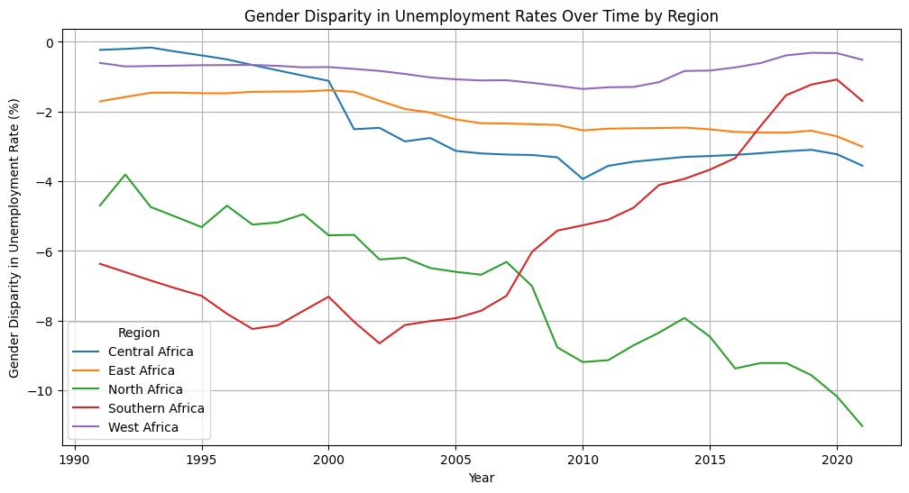

# 10Alytics Hackathon 2023: Unravelling the Challenges of Unemployment in Africa - A Data Driven Approach 
==============================

<p align="center">
  
</p>

Unemployment remains one of the most daunting challenges facing African nations today. It is a multifaceted problem with deep roots in socio-economic, educational, and policy-related factors. 

This project employs a comprehensive, data-driven approach to analyze unemployment across Africa. We examined a range of factors - from government expenditure on education and private sector growth to infrastructure development - to understand their impacts on regional unemployment rates. The analysis reveals critical insights into the multifaceted nature of unemployment challenges in Africa.

## Entry by: Paul Okafor
---
## [View Notebook](https://nbviewer.org/github/obinopaul/Unravelling-the-challenges-of-Unemployment-in-Africa-10Alytics-Hackathon-2023/blob/main/Paul_hackathon.ipynb)

<p align="center">
  
</p>

## Key Findings and Implications
| Key Findings | Implications |
|--------------|--------------|
| High unemployment rates in Central and Southern Africa | Regional approaches needed |
| Greater unemployment among women | Address socio-economic and cultural barriers |
| National youth strategies lack direct correlation with lower unemployment | Strategies need effective implementation |
| Long-term benefits of education investment | Immediate effects on unemployment may not be visible |
| Firm growth not always aligned with population growth | Encourage private sector development to match workforce needs |
| Access to electricity correlates with firm growth | Invest in infrastructure to support economic activities |
| Varied regional and gender impacts on unemployment | Dynamic, real-time policy-making and monitoring essential |

## Requirements
You can install all these packages by running ```pip install -r requirements.txt``` in the command line.

<p align="center">
  
</p>

## Recommendation
To tackle unemployment in Africa, a multipronged strategy is essential. Investing in education and vocational training that align with current market demands will create a skilled workforce ready for tomorrow's jobs. Strengthening infrastructure, particularly electricity and digital connectivity, will underpin economic growth and firm expansion. Encouraging entrepreneurship through easier access to finance and streamlined business regulations can spur private sector development, a critical engine for job creation. Additionally, fostering sectors with high growth potential, such as agriculture and technology, can open new employment avenues. Finally, establishing robust social safety nets and promoting regional economic integration will cushion against joblessness and encourage a broader, more resilient job market. Tailoring these strategies to individual country contexts will be key to their success.

